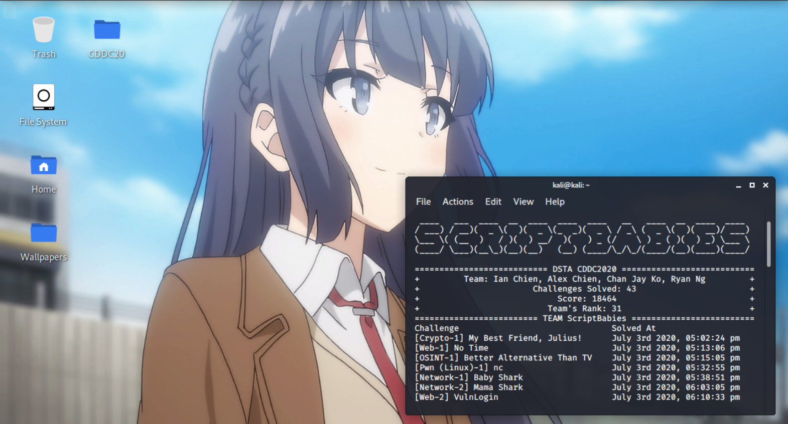
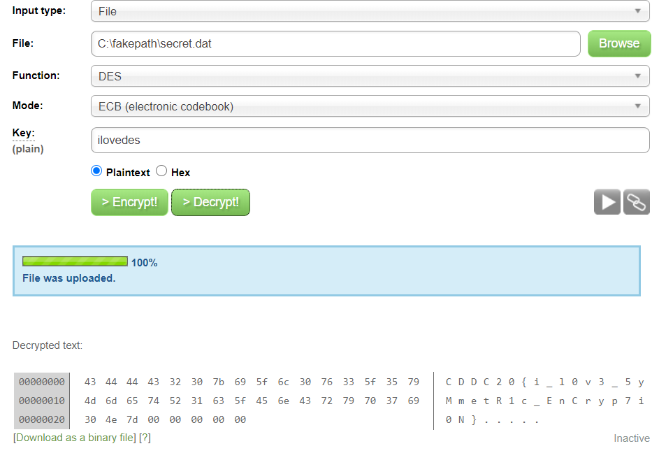

# CDDC 2020

[5-10 Minute Read]
Team NYP ScriptBabies

CTF Hosted by dsta.gov.sg/CDDC (https://www.dsta.gov.sg/brainhack)

```
Put your cybersecurity skills to the test! Solve team challenges, quizzes, and take part in an exhilarating 48-hour online team competition.
New to cybersecurity? Fret not – there’s a comprehensive online training programme to equip you with the necessary techniques!

Organised by the Defence Science and Technology Agency (DSTA), the Cyber Defenders Discovery Camp (CDDC) returns for its eighth edition, as part of the BrainHack experience!

If you are curious about cyber defence, or looking for a fun and exciting way to level up your cyber skills, mark your calendars for CDDC 2020 from 3 to 5 July!

Pick up and practise fundamental cybersecurity techniques through our online training programme from 8 to 28 June to get up to speed. Face off against fellow enthusiasts and clear team challenges in an online Capture-The-Flag competition! Top teams stand to win attractive prizes.

The camp consists of two categories: students in local junior colleges / Integrated Programme schools (Year 5 and 6) / Institutes of Technical Education; and full-time students in universities (undergraduates) / polytechnics.
```



## Overview

```
Challenge                                     Warp Gate       Flag
[Misc-1] Welcome to CDDC 2020                 WARP GATE 5     CDDC20{g1mM3_M0aRRr_pOiN75}
[Misc-2] ARGH                                 WARP GATE 5     CDDC20{c0mManD_l1n3_ArguM3n75sSs}
[Misc-3] Add to Your Reading List             WARP GATE 5     CDDC20{KNOW_UR_RIGHTS}
[OSINT-1] Better Alternative Than TV          WARP GATE 5     CDDC20{S+@rt_O$!nT}
[OSINT-2] Fun with File Extensions            WARP GATE 5     CDDC20{EVIL_CORP_CH@RT}
[OSINT-3] Transparency is the Best Policy     WARP GATE 5     CDDC20{CERT_TR4SP4RENCY}
[RE (Windows)-1] Decompile Me                 WARP GATE 5     CDDC20{NiCe-2-MeeT-py2exe~:D}
[RE (Windows)-2] Dissect Me                   WARP GATE 5     CDDC20{UR-di$$ector}
[RE (Windows)-3] Cheat Me                     WARP GATE 5     CDDC20{T1ck-T0ck_T1ck-T0ck}
[Pwn (Linux)-1] nc                            WARP GATE 5     CDDC20{NiceToMeetYou@PwnWorld}
[Pwn (Linux)-2] (2^31)-1                      WARP GATE 5     CDDC20{oO0OoO0o0OoO0Oo}
[Pwn (Linux)-3] Find Singapore Bug            WARP GATE 5     CDDC20{AAAABBBB-Oh~YouLeakedIt-CCCCDDDD}
[Forensics-1] Can't See A Thing               WARP GATE 5     CDDC20{pho70gr4phy_i5_aw3sOmE}
[Forensics-2] Shell History                   WARP GATE 5     CDDC20{Sh4LL_we_Sh3LL?}
[Forensics-3] Top Secret                      WARP GATE 5     CDDC20{Lorem-Ipsum-Foo-Bar}
[Web-1] No Time                               WARP GATE 5     CDDC20{N0_71m3_nO_tiMe_oMG}
[Web-2] VulnLogin                             WARP GATE 5     CDDC20{administrator_password12345678}
[Web-3] Keep Me Posted                        WARP GATE 5     CDDC20{YEs5SS_1_4m_aUTh0r1z3DDdD}
[Crypto-1] My Best Friend, Julius!            WARP GATE 5     CDDC20{CAESAR_SELLS_SEASHELLS_BY_THE_SEASHORE}
[Crypto-2] Cryptic Message                    WARP GATE 5     CDDC20{HERETURNS}
[Crypto-3] Iffy Glyphs                        WARP GATE 5     CDDC{WELOVETODANCEANDCODEALLDAYLONG}
[Network-1] Baby Shark                        WARP GATE 5     CDDC20{TLP_RED_EYES_ONLY}
[Network-2] Mama Shark                        WARP GATE 5     CDDC20{JUST_GIVE_ME_TL:DR}
Very Serious Challenge!                       WARP GATE 5     CDDC20{THANK_YOU_FOR_PLAYING}

[OSINT-1] Funky Transfer Pact                 WARP GATE 4     CDDC20{@n0nymous_FTW}
[OSINT-2] Follow the Breadcrumbs              WARP GATE 4     CDDC20{Fl!ckr_0h_Flick3r}
Visual Noise                                  WARP GATE 4     CDDC20{V1suAl_CrYPT0_iS_s0_53cuRE}
ilovedes                                      WARP GATE 4     CDDC20{i_l0v3_5yMmetR1c_EnCryp7i0N}
Recycling Bin                                 WARP GATE 4     CDDC20{cArv3_C4Rve_CaRV33eE}
Something's Going On                          WARP GATE 4     CDDC20{STOP_STRUTTING_AROUND}
What Time Is It? [1]                          WARP GATE 4     CDDC20{_ItI_sN3_ver_Too_Lat_eT0_Ask_Wha_tT1_me1_tI5_!!}
Ma GIFs                                       WARP GATE 4     CDDC20{w0W_u_hAz_FlaG!!h3he}
Great Sphinx of Unduplicitous Corp            WARP GATE 4     CDDC20{Y0u_arE_s0Ooo00_QU1CK_@nd_SM@RT}
Greater Sphinx of Unduplicitous Corp          WARP GATE 4     CDDC20{Gr3at!!!_N0T_thA7_H@RD_r1ght?}
Between 0&1                                   WARP GATE 4     CDDC20{Ev1dence_H1dden_Between_0&1}
How QueeR...                                  WARP GATE 4     CDDC20{Qu1Rky_quEeR_qUe57ion4bL3_c0d35s}
Suspicious Service                            WARP GATE 4     CDDC20{BufferrrrrrrrrOverflowwwwwwwwwwwwwwwwwwwww}
Secret Code                                   WARP GATE 4     CDDC20{E4syR3v3rS1ng~}

[OSINT-1] There's A T In Every Flag           WARP GATE 3     CDDC20{TR3LL0_D!$c0v3red}
[OSINT-2] Travel Ban                          WARP GATE 3     CDDC20{C30_Tr@ck3d_u$!nG_0S!n+}
[OSINT-3] Who Needs A Password Manager        WARP GATE 3     CDDC20{ALPHA_CU7TinG_i5_n0t_SecuR3}
My Favourite Music                            WARP GATE 3     CDDC20{MORSELSB}
Clickity Clack                                WARP GATE 3     CDDC20{YOU_AS_BEE_FUN}
```


## [Misc-1] Welcome to CDDC 2020

**Challenge**

Free points for all! See you on Slack! ;)

**Solution**

As mentioned in the challenge description, ‘see you on slack’ when we navigated about the slack channel, we found the flag under the ‘details’ section.

**Flag**

```
CDDC20{g1mM3_M0aRRr_pOiN75}
```

## [Misc-2] ARGH

**Challenge**

I found a binary, together with this long string that looks like some password. I wonder what is it for...

Key: GZ2gXZ3bD2qqNyNxXb5LJ8HfHQtTL5VHA

Attached Files: myprog

**Solution**

The file header is first checked, of which we quickly find out that it is an .ELF (Linux executable). The program is initially run to see that there were insufficient arguments. Since there is a key, we pass in the key together with the program and we get the flag for the challenge!


**Flag**

```
CDDC20{c0mManD_l1n3_ArguM3n75sSs}
```

## [Misc-3] Add to Your Reading List

**Challenge**

As part of our resistance fighters' training program, we need to arm ourselves with academic knowledge. By the graces of my kind senior, he passed me some recommended reading materials.

One pdf seems to be annotated, while the other isn't. I wonder what is the difference between the two.. Can you spot it?

Attached Files: Reading_Material.zip

**Solution**

We used the tool: https://www.diffchecker.com/diff and uploaded both PDFs in the online tool.

The flag can be eyeballed from the differences spotted in the pdf.

**Flag**

```
CDDC20{KNOW_UR_RIGHTS}
```

## [OSINT-1] Better Alternative Than TV

**Challenge**

Looks like we found a clue to the mastermind behind the brainwashing liquid.

The company's name is UnduplicitousCorp, sounds kinda fishy. Let's conduct some basic reconnaisance and see if there's any videos about the company on social media.

**Solution**

Simplest OSINT challenge that gave us the flag right away when we searched for the company name. Youtube also was relevant to TV, which gave us the confirmation that we had the correct flag.


**Flag**

```
CDDC20{S+@rt_O$!nT}
```

## [OSINT-2] Fun with File Extensions

**Challenge**

Now that we have their company website, it will be helpful for us to know how the company layout is like.

Note: This challenge does not require brute-forcing. There is no need to do so.

**Solution**

Opening up the pdf, we see this chart. Just by eyeballing it, we knew that the flag was beneath the chart in the middle. However, at the bottom right of the document, there was an interesting message:
‘I wonder how to get an editable version of this’


Initially, since this seemed like a powerpoint document, we changed it to .pptx and opened it with microsoft powerpoint, but we could not drag out the individual elements. So we decided to use microsoft word to edit it.

The pdf file was converted to word document with an online tool before shifting the elements around a bit, which uncovered the flag.

**Flag**

```
CDDC20{EVIL_CORP_CH@RT}
```

## [OSINT-3] Transparency is the Best Policy

**Challenge**

The website looks state-of-the-art. As expected of a evil mega conglomerate.

Okay, they're using HTTPS certificate, very secure. Is there any way we can discover what other domains they are hosting?

Note: This challenge does not require brute-forcing. There is no need to do so.

**Solution**

We got stuck here for a very long time and apparently did not know we were supposed to look up for all subdomains for this challenge. I personally went to look at all the site certificates but nothing. That was when we went to slack to look for hints, and realised it was literally related to transparency.


https://transparencyreport.google.com/https/certificates?hl=en&cert_search_auth=&cert_search_cert=&cert_search=include_subdomains:true;domain:unduplicitouscorp.tech&lu=cert_search


**Flag**

```
CDDC20{CERT_TR4SP4RENCY}
```

## [RE (Windows)-1] Decompile Me

**Challenge**

Hello py2exe, nice to meet you!

Attached Files: DecompileMe.zip

**Solution**

Reading up on python decompilation, I stumbled upon this really useful article which included the tool link as below: https://blog.f-secure.com/how-to-decompile-any-python-binary/
Tool: https://github.com/countercept/python-exe-unpacker

-1%5D%20Decompile%20Me1.png)

**Flag**

```
CDDC20{NiCe-2-MeeT-py2exe~:D}
```

## [RE (Windows)-2] Dissect Me

**Challenge**

LET THE GAMES BEGIN!

Attached Files: DissectMe.exe

**Solution**

Extract files with 7zip and look under BITMAP. The flag is in FLAG.bmp

-2%5D%20Dissect%20Me.png)

**Flag**

```
CDDC20{UR-di$$ector}
```

## [RE (Windows)-3] Cheat Me

**Challenge**

Be patient :) Then you can get what you want.

Attached Files: CheatMe.exe

**Solution**

Cheat Engine. Select the running Cheatme.exe program and change scan type to “Exact value” and value to “All” since we do not know the data type. Enter the number in the minutes place. First scan is then performed. When the minute value changes, key in the 2nd number which is 54 then click “Next scan”. A single address should appear. Change the value to “0” and repeat for the hours. When time is up, viola! Flag appears.

-3%5D%20Cheat%20Me1.png)

**Flag**

```
CDDC20{T1ck-T0ck_T1ck-T0ck}
```

## [Pwn (Linux)-1] nc

**Challenge**

Hello PwnWorld!

nc.chall.cddc20.nshc.sg 10000

**Solution**

The challenge name gave away that this was a netcat challenge. So we just interacted with the given IP and port and voila!

**Flag**

```
CDDC20{NiceToMeetYou@PwnWorld}
```

## [Pwn (Linux)-2] (2^31)-1

**Challenge**

I like zer0.

zer0.chall.cddc20.nshc.sg 20002

**Solution**

We know max is: (2^32)-1 = 4294967296 - 1

-2%5D%20(2%5E31)-1.png)

Using netcat and putting the maximum limit, we get the flag!

**Flag**

```
CDDC20{oO0OoO0o0OoO0Oo}
```

## [Pwn (Linux)-3] Find Singapore Bug

**Challenge**

Let's FSB!

fsb.chall.cddc2020.nshc.sg 30303

**Solution**

Format String Bug. We had to leak the stack from the program. After getting the dump, we changed the hex to ascii, changed the endianness and got the flag!

**Flag**

```
CDDC20{AAAABBBB-Oh~YouLeakedIt-CCCCDDDD}
```

## [Forensics-1] Can't See A Thing

**Challenge**

What kind of lousy photographer takes terrible pictures like these?

Attached Files: img.jpg

**Solution**

exif tool


**Flag**

```
CDDC20{pho70gr4phy_i5_aw3sOmE}
```

## [Forensics-2] Shell History

**Challenge**

What happened to my server? Please help me to investigate.

Username: root / Password: toor

Attached Files: Shell History.ova

**Solution**

We decided to list the files with ls, but nothing. So we decided to use (ls -al) to list all files and found out that there was a directory called  .ash_history. That seemed like it, so we cat the entire bash history out and we can find that the flag is under the echo command.


**Flag**

```
CDDC20{Sh4LL_we_Sh3LL?}
```

## [Forensics-3] Top Secret

**Challenge**

Where is the secret?

Attached Files: TopSecret

**Solution**

Reference writeup: https://poqw.tistory.com/14
FTK imager was used. Convert the file to .AD1 extension before adding logical evidence drive and extracting the files.


**Flag**

```
CDDC20{Lorem-Ipsum-Foo-Bar}
```

## [Web-1] No Time

**Challenge**

Our project manager couldn't handle the stress from the upcoming deadlines and resigned hastily. Sigh. Now that we are taking over his projects, I wonder if he has left any instructions for us...

http://notime.chall.cddc20.nshc.sg:1337/

**Solution**

Inspect element


**Flag**

```
CDDC20{N0_71m3_nO_tiMe_oMG}
```

## [Web-2] VulnLogin

**Challenge**

This is not how you log someone in!

http://vulnlogin.chall.cddc2020.nshc.sg:8090/

Note: Flag format is CDDC20{username_password}

**Solution**

Inspect element gave us the MD5 hashes of the login credentials, which we used Crackstation to crack the hashes.


Crackstation tool used to crack the hashes.


**Flag**

```
CDDC20{administrator_password12345678}
```

## [Web-3] Keep Me Posted

**Challenge**

Some weird page. Looks fishy. Please help.

**Solution**

Burp Suite + POST Request in Base64 encoding of 'Yes'. The flag was immediately returned.

**Flag**

```
CDDC20{YEs5SS_1_4m_aUTh0r1z3DDdD}
```

## [Crypto-1] My Best Friend, Julius!

**Challenge**

Julius is always sending me cryptic messages. Hmm.

JHLZHY_ZLSSZ_ZLHZOLSSZ_IF_AOL_ZLHZOVYL

Note: Decrypted text does not include the flag format "CDDC20{}". Add in the flag format "CDDC20{}" during submission, and ensure that the flag string is fully in uppercase, i.e. CDDC20{SAMPLE_FLAG}.

**Solution**

Caesar Cipher


**Flag**

```
CDDC20{CAESAR_SELLS_SEASHELLS_BY_THE_SEASHORE}
```

## [Crypto-2] Cryptic Message

**Challenge**

we are not sure what is this gibberish all about, hmm. Can you help us to decode this message?

hq hm kbg jipoox yhnnhatog qb abkmajtaq p mijhim bn hknijikaim, ipaS yidikyikq tdbk hqm djlyiaimmbJ pky ipas mhcdoi hk hqmion. hn, pnqij ybhkg mb, bkl mhcdox rkbarm btq poo qsi aikQjpo hknijikaim pky djimikqm bki'm ptyhikai vhqs qsi mapjqhkg-dbhkq pky qsi abkaoTmhbk, bki cpx dJbytai p mqpjqohKg, qsbtgs dbmmhlox p cijiqjhahbtM, inniaq.

Note: Decrypted text does not include the flag format "CDDC20(}". Add in the flag format “CDDC20{}" during submission, and ensure that the flag string is fully in uppercase, i.e. CDDC20{SAMPLEFLAG}.

**Solution**

Tool: https://www.guballa.de/substitution-solver


Looking at all the capitalised text, we form the flag: HERETURNS

**Flag**

```
CDDC20{HERETURNS}
```

## [Crypto-3] Iffy Glyphs

**Challenge**

At first glance this looks like a kid's drawing, but my astute detective instincts tells me otherwise...

Note: Decrypted text does not include the flag format "CDDC20(}". Add in the flag format “CDDC20{}" during submission, and ensure that the flag string is fully in uppercase, i.e. CDDC20{SAMPLEFLAG}.

Attached Files: what_is_this.PNG

**Solution**

Dancing Man Cipher solver on DCode


**Flag**

```
CDDC{WELOVETODANCEANDCODEALLDAYLONG}
```

## [Network-1] Baby Shark

**Challenge**

Recently the Resistance Fighters have discovered this new thing called Wireshark, it seems to be some kind of tool used for analysing network packets.

We tried to capture a little snippet of traffic while browsing the web just to check out its capabilities. Let's check out what it can do.

Attached Files: easy.pcap

**Solution**

Wireshark Export Objects, Confidential.pdf


**Flag**

```
CDDC20{TLP_RED_EYES_ONLY}
```

## [Network-2] Mama Shark

**Challenge**

We have received a new packet for analysis.

Oh damn, there's too much more traffic to look through.. Is there a shortcut to find what we're looking for immediately?

Attached Files: noisy.pcap

**Solution**

Wireshark Export Objects, yumcheese.txt


**Flag**

```
CDDC20{JUST_GIVE_ME_TL:DR}
```

## Very Serious Challenge!

**Challenge**

Please give us your brutally honest feedback!!

https://forms.gle/uGnArnXFoRsgxDZe9

**Solution**

Literally the easiest challenge, we were expecting this on the last day so it was a free kill. Nothing had to be done apart from completing the google forms feedback.

**Flag**

```
CDDC20{THANK_YOU_FOR_PLAYING}
```

## WARP GATE 4

## [OSINT-1] Funky Transfer Pact

**Challenge**

Being such a huge conglomerate, it can't be that they only have a tiny web server..

**Solution**

ftp://unduplicitouscorp.tech


**Flag**

```
CDDC20{@n0nymous_FTW}
```

## [OSINT-2] Follow the Breadcrumbs

**Challenge**

Following the breadcrumbs, this employee seems like an aspiring photographer.

**Solution**

Visit the projects page on flickr https://www.flickr.com/people/188575548@N05/


**Flag**

```
CDDC20{Fl!ckr_0h_Flick3r}
```

## Visual Noise

**Challenge**

I intercepted some emails from Unduplicitous Corp, that had these pictures attached to them. Looks like visual noise but then again, I can't be sure....

Attached Files: so-noisy.png | much-confusing.png

**Solution**

Tool used: https://www.diffchecker.com/image-diff


**Flag**

```
CDDC20{V1suAl_CrYPT0_iS_s0_53cuRE}
```

## ilovedes

**Challenge**

I heard that the CFO of Unduplicitous Corp loves using DES to encrypt his data, LOL.

Attached Files: secret.dat

**Solution**

Tool used: http://des.online-domain-tools.com/



The key was in the challenge description.

**Flag**

```
CDDC20{i_l0v3_5yMmetR1c_EnCryp7i0N}
```

## Recycling Bin

**Challenge**

Found this file in one of the Unduplicitous Corp's PCs Recycle Bin. Can you walk me through this?

Attached Files: 1.img

**Solution**

We had some interesting finds in the strings command. It gave us an idea of the files that should be seen after we done the file extraction with 7zip.


In the end, file renaming of test.zip to test.xlsx was done, which gave the flag.


**Flag**

```
CDDC20{cArv3_C4Rve_CaRV33eE}
```

## Something's Going On

**Challenge**

Looks like we found a hidden secret left behind by one of the Resistance Fighters while they were snooping around Unduplicitous Corp's network.

All we have to go on is this pcap file. How about it? Can you discover its secret?

Attached Files: analyse.pcap

**Solution**

Following TCP streams, a number of files were being transferred. Upon filtering stream 26, there are RSA private and public certificates which can be used to decrypt the file. Openssl can be used to decrypt.

**Flag**

```
CDDC20{STOP_STRUTTING_AROUND}
```

## What Time Is It? [1]

**Challenge**

What time is it?

2005.10.06 05:23:15

2020.10.05 22:39:46

2020.08.29 05:16:57

2020.08.12 10:05:39

2020.09.29 06:36:38

2020.09.27 00:41:56

2020.09.30 18:43:24

2020.08.10 03:54:13

2020.09.24 00:09:37

2020.09.16 09:20:23

2020.08.10 22:06:44

2020.08.10 23:19:09

2020.08.13 22:08:52

1987.04.11 00:43:13

**Solution**

Unix timestamps and conversion to plaintext.


**Flag**

```
CDDC20{_ItI_sN3_ver_Too_Lat_eT0_Ask_Wha_tT1_me1_tI5_!!}
```

## Ma GIFs

**Challenge**

Well apparently, the CTO of Unduplicitous Corp love, love, LOVE GIFs! ;)

http://magifs.chall.cddc2020.nshc.sg:13373/

**Solution**

Use weevely to generate a .php backdoor

Use burp suite to change the file type from application/php to image/gif , so the web application will accept the php code. Cannot append a .gif to the php file (can’t be backdoor.php.gif. this wont work)

Once php file uploaded, use weevely to get the shell.Directory traversal the machine to find the flag (It’s one folder above the current folder)

**Flag**

```
CDDC20{w0W_u_hAz_FlaG!!h3he}
```

## Great Sphinx of Unduplicitous Corp

**Challenge**

We discovered Unduplicitous Corp's training site for their engineers. The instructions were prettu clear: get to Stage 100 as soon as possible!

http://great-sphinx.chall.cddc20.nshc.sg:1111/

**Solution**

Python programming challenge that utilises selenium library to get math elements. For loop 100 times as required by the challenge levels.

**Flag**

```
CDDC20{Y0u_arE_s0Ooo00_QU1CK_@nd_SM@RT}
```

## Greater Sphinx of Unduplicitous Corp

**Challenge**

Ahh, yet another one. This time round, get to Stage 50 as soon as possible.

http://greater-sphinx.chall.cddc2020.nshc.sg:9999/

**Solution**

Selenium was used again.

**Flag**

```
CDDC20{Gr3at!!!_N0T_thA7_H@RD_r1ght?}
```

## Between 0&1

**Challenge**

While Unduplicitous Corp was conducting Incident Response on several legacy PCs, our trusty Insider, Resistance Fighter XAE found some weird activity on the PC.

Let's investigate.

Attached Files: dump

**Solution**

Volatility used to analyse the dump and the dump was converted from binary to text.

**Flag**

```
CDDC20{Ev1dence_H1dden_Between_0&1}
```

## How QueeR...

**Challenge**

We realised that Unduplicitous Corp uses this code for their assets tagging. But we can't figure out how exactly to decode it, hmm.

Attached Files: barcode.gif

**Solution**

Tool used: https://getsharex.com/
We used the Sharex tool in the end to solve this challenge.
Sharex > tools > QR code > Decode


**Flag**

```
CDDC20{Qu1Rky_quEeR_qUe57ion4bL3_c0d35s}
```

## Suspicious Service

**Challenge**

While conducting reconnaissance on Unduplicitous Corp, we found a suspicious service. Let's figure out what this is.

ss.chall.cddc2020.nshc.sg 7777

Attached Files: SuspiciousSvc

**Solution**

Reverse engineering and buffer exploitation
python -c ‘print(“\x90”*256+”\x00\x3d\x34\x01”)’ | ./SUSsvc
Now replace “./SUSsvc” with the netcat to the server. Flag will be returned (Server down by time writeup done)

**Flag**

```
CDDC20{BufferrrrrrrrrOverflowwwwwwwwwwwwwwwwwwwww}
```

## Secret Code

**Challenge**

What is the SECRET CODE?

Attached Files: SecretCode

**Solution**

Reverse engineering using Ghidra

**Flag**

```
CDDC20{E4syR3v3rS1ng~}
```

## WARP GATE 3

## [OSINT-1] There's A T In Every Flag

**Challenge**

Every self-respecting company needs a social media presence. There must be more we can discover about UnduplicitousCorp.

**Solution**

Twitter > Trello link manipulation.
After clicking around at the various challenges, we looked in administrative work, to find the flag! https://trello.com/c/sXSFRP4U/4-cddc-2020-administrative-work


**Flag**

```
CDDC20{TR3LL0_D!$c0v3red}
```

## [OSINT-2] Travel Ban

**Challenge**

Looks like even the CEO is gonna have a hard time getting out of the country. All his billions can't get past those travel restrictions.

**Solution**

Scan barcode with the boarding pass and the flag is in plaintext.
Source: https://trello.com/c/01wkbj9U/1-book-ceo-flights


**Flag**

```
CDDC20{C30_Tr@ck3d_u$!nG_0S!n+}
```

## [OSINT-3] Who Needs A Password Manager

**Challenge**

The CEO's secretary hates password managers. "Why do you even need one when there is a better way to keep your passwords secret?"

**Solution**


Stegsolve offset


**Flag**

```
CDDC20{ALPHA_CU7TinG_i5_n0t_SecuR3}
```

## My Favourite Music

**Challenge**

We found a suspicous WAV file in Unduplicitous Corp's server. Hmm.

Attached Files: original.wav | suspicious.wav

**Solution**

Audacity


**Flag**

```
CDDC20{MORSELSB}
```

## Clickity Clack

**Challenge**

Our trusty insider XAE had planted a network sniffer in one of Unduplicitous Corp's plant office. It's our chance to unravel the secrets of this pcap file!

Attached files: sniffed.pcap

**Solution**

Used github script to extract text from .pcap file https://github.com/WangYihang/UsbKeyboardDataHacker

It gives a password to use: IamSuperC0olAmiRiTe!
Subsequently, by unizpping the .pcap file with required password, there are 2 files: Flag.txt and confidential.pdf


**Flag**

```
CDDC20{YOU_AS_BEE_FUN}
```
